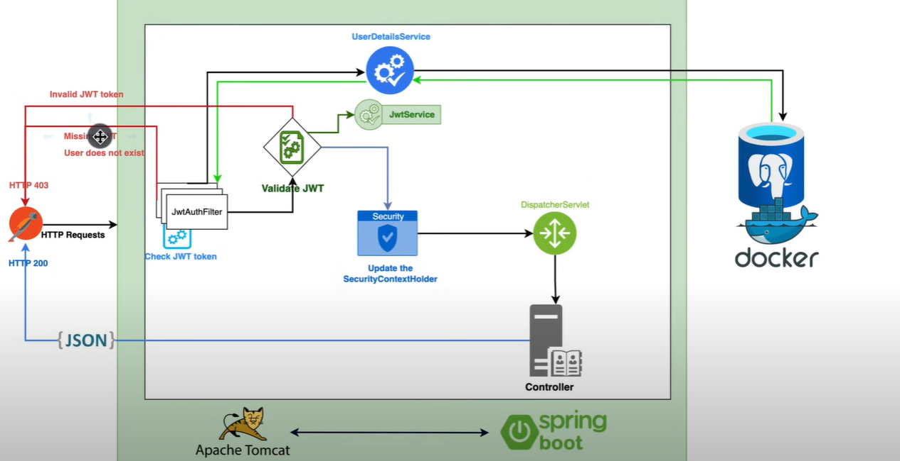

[Spring Boot 3 + Spring Security 6 - JWT Authentication and Authorisation ](https://youtu.be/KxqlJblhzfI)



### JWT Validation Mechanism
- client sends a request to the backend system
- hits the filter (the first thing that gets executed in the application)
    - internal check to check whether we have the jwt token or not
    - if no token is present
        - send a 403 response to the client
    - once it checks, it extracts the subject ( username or email (well depending))
    - the internal excution of the filter, makes a call using the UDS (user details service), to try and get  user information
    from the database. it ddoes this using the say, email it has extracted froom the token
        - if the user does not exist, send a 403 response
    - a validation process starts once the user exists
- so the validate jwt will call the jwt service
    - if the token is invalid (exipred, not for that user)
        - send a 403 back
    - if everything is fine, then you will update the SCH (security context holder)
- once this happens the request will go t the dospactcher servlet -> then to the controller -> send the response successfully

### Implementing
- notice that we needed a UserDetailsService
- so for a user in the application, implement the UserDetailsService

- One can define a user say AppUser and extend the `User` from spring security

## Creating the JWT filter
- we want this to fire anytime there is a request
 - extends the `OncePerRequestFilter` or one cna simply use `filter`

```java

// the parameters should not be null
public class JwtAuthenticationFilter extends OncePerRequestFilter {
    @Override
    protected void doFilterInternal(HttpServletRequest request, HttpServletResponse response, FilterChain filterChain) throws ServletException, IOException {

    }
}


@Component  // making it a spring managed bean
@RequiredArgsConstructor  // any final field would be in the constructor
public class JwtAuthenticationFilter extends OncePerRequestFilter {
    @Override
    protected void doFilterInternal(@NonNull HttpServletRequest request, @NonNull HttpServletResponse response, @NonNull FilterChain filterChain) throws ServletException, IOException {

    }
}

```

- we check for the JWT TOKEN
- it should be in the header called - Authorization
- Bearer token always starts with "Bearer .."
- if the auth-header is null or does not start with "Bearer ", just pass on to the next filter and make an early return
- extract out the jwt after the "Bearer "
- use the JWT service (you create it) to extract the username (what you  defined as the subject)

## Creating the JWT service
- we need a couple of dependencies
- `jjwt-api`,  `jjwt-impl`, `jjwt-jackson` from the groupId `io.jsonwebtoken`
- visit [https://jwt.io/](https://jwt.io/)
- we need a method to get all the claims
    - and one to get what we want
    - we will use the `Jwts` to extract the claims

### Understanding JWT
- JWT - json web token : claims to be transfered between different parties
    - we have the 
        - header
        - payload
        - signature
- note that we have a sign in key (256 in size) that is used to sign the token
    - that is the signature part of the JWT